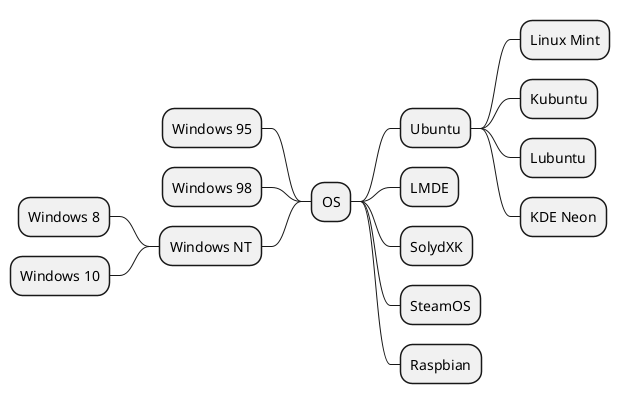
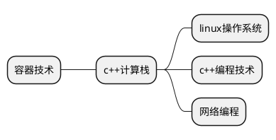

# PlantUml

```plantuml
@startmindmap
+ OS
++ Ubuntu
+++ Linux Mint
+++ Kubuntu
+++ Lubuntu
+++ KDE Neon
++ LMDE
++ SolydXK
++ SteamOS
++ Raspbian
-- Windows 95
-- Windows 98
-- Windows NT
--- Windows 8
--- Windows 10
@endmindmap
```
## 第二标题

```plantuml
@startmindmap
+ c++计算栈
++ linux操作系统
++ c++编程技术
++ 网络编程
-- 容器技术
@endmindmap
```


```c++

#include <iostream> 
int main() {
    std::cout << " 第一个 plantuml"  <<  std::endl;
}
```